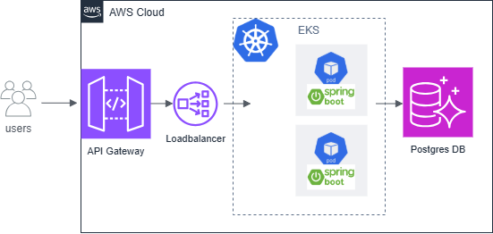
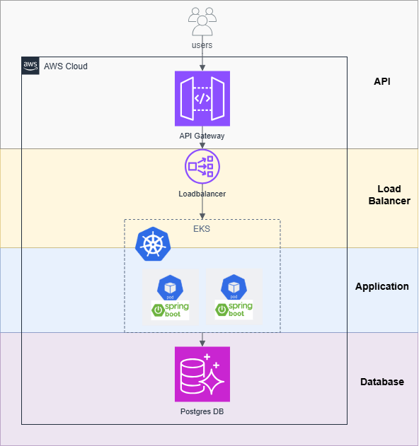
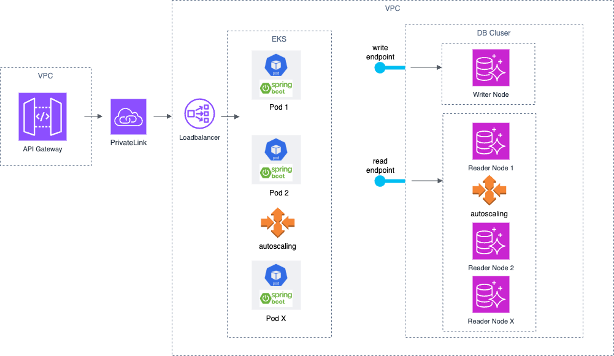
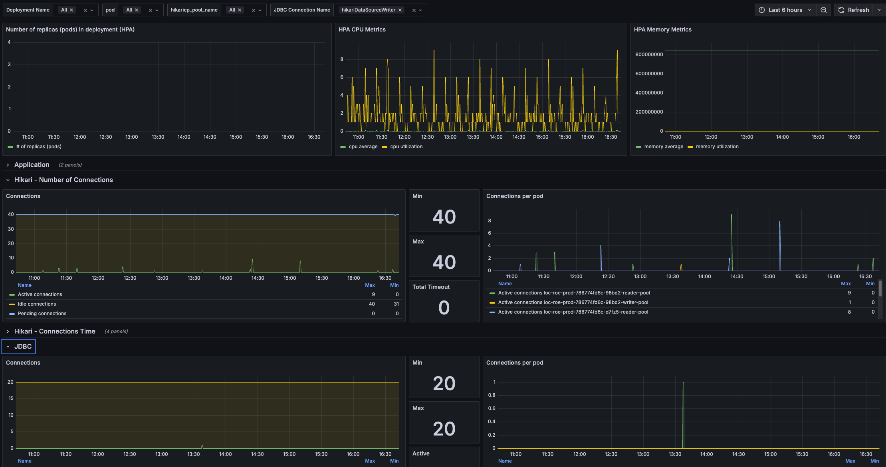

Maximizing performance across the stack
=======================================

Performance may not necessarily be the first thing a developer worries about when developing software. But as a solution matures the aspect of performance will play its part sooner or later!

# Non functional requirements
Non-functional requirements (NFRs) are the key drivers in defining and designing a systems architecture. Performance is one example of such a NFR.
In our case, where it is about to build a new `iot cloud platform` and ambition is to serve a growing market (number of iot devices, number of users), performance and scalability plays a key role.

Below is a simplified overview of some aspects of the chosen architecture to enable these NFRs:



It shows one service of a microservice architecture. Each service runs in a AWS cloud and exposes a REST API via API Gateway.
Traffic from the Gateway is forwarded via a loadbalancer to the actual backend application. The application in this case is built with java spring boot and runs on AWS EKS which is a managed kubernetes service. For the database, Aurora with an RDS for PostgreSQL engine is used.

Given the above architecture, one could think that's it. We are in the cloud and our workloads run on kubernetes, no need to worry about scalability and performance. But thats not the case. As usual, there are many ways to do things wrong. Or in a more positive way: there are many ways to do things even better!

# Know and test your requirements
I like simplicity and think its important to not over engineer a solution. So before you start optimizing, very important:
be really sure what your target NFRs are, what their impact is and how you want to test them! If not needed, dont optimize!

Performance related NFRs are things like Response Time, Scalability, Load handling, Availability, Throughput, Latency, ...

In our use case its about a service for managing locations (e.g. buildings), indoor locations (e.g. floors or rooms) and assets (e.g. devices).
So beside other requirements we had e.g. the following requirements:
- Service must be able to handle 500'000 locations
- Service must be able to handle 100'000 devices
- Latency on the external API: 99% of the request (p99) should be faster than 500 ms

# Improving performance

Lets have again a look at the overview picture above. And lets split the app into multiple layers where we later will spend some time and analyze possible performance improvements and pitfalls:




## Database

### Chose your weapon
Of course, the choice of which database to use already has a big impact regarding performance. So you really need to know the data you are dealing with and ideally the data access patterns. This is no simple task and as usual, there is no single, golden choice but rather a long list of considerations and compromises. Are we dealing with time-series like data? How is the data structured? Is it even structured? What are the relationships between data? How will the service evolve? What are the consumers of the data and what are their needs?

Its good if the architect makes a conscious decision taking into account the above questions. And in my opinion also important not to change the DB every half a year just because there is yet another new great database that is "so much better than everything else on the market".

In our case we took a Aurora PostgreSQL DB as our "weapon". No graph DB or NoSQL DB, just a "classical" relational database. Each database has its own characteristic and challenges, so not all of the following aspects may apply.

### Table Design

We all probably learnt once that a relational DB should be normalized in the third form (3NF). Thats a good starting point and avoids redundancy. Performance adjustments and thoughts into denormalization should come much later, if really needed. Also make sure the right data types are used and have a look at the sizes for text columns: Do you really need 500 characters for a phone number? Probably not. Less storage space will help you speed up things.
What is the inheritance strategy you want to use? We started with a "table per concrete class" and later switched to "single table" inheritance. This mainly because we wanted to support read patterns which required Common Table Expression (CTE). This enabled sort of efficient queries for returning an entire building structure. E.g. like returning a location (e.g. a specific building) and all its child locations (floors and rooms) in a hierarchical way.

### Indexing

We faced some bottlenecks when we started to analyze our queries. And most issues were related to missing indexes. Its really crucial to have indexes e.g. for join columns.

```sql
CREATE INDEX idx_locations_is_part_of ON locations(is_part_of);
```

For us adding indexes helped drastically to improve or rather "fix" performance (read), especially when tested and measured with higher loads. This simply because we forgot to define some "obvious" indexes. But indexes require storage and will have a bit of overhead on CUD operations.

### Query Optimization

In our setup we were using JPA (Java Persistance API) as an ORM (Object Relational Mapping). Its crucial for performance analysis, being able to analyze the executed SQL queries. In our setup on AWS, this is not enabled by default. You need to configure a few things properly:

- log queries that take longer than a threshold and add auto explain:
    ```terraform
    resource "aws_rds_parameter_group" "postgresql_parameter_group" {
    name   = "my-postgresql-parameter-group"

    parameter {
        name  = "log_min_duration_statement"
        value = var.log_min_duration_ms
    }

    parameter {
        name  = "auto_explain.log_min_duration"
        value = var.log_min_duration_ms
    }
    }
    ```

- enable enhanced monitoring and performance insights for getting detailed performance metrics
  - e.g. most time consuming SQL queries or what the database is waiting on (I/O, locks, ...)
  ```terraform
  resource "aws_rds_cluster_instance" "aurora_cluster_instance" {
    monitoring_interval = 10 # 10s
    performance_insights_enabled = true
  }  
  ```    

### Multi AZ & Read Replicas
For a production ready setup with high availability, we wanted to have multi availability zones (AZ). Aurora supports this out of the box. For scaling the read operations we also defined read replicas.

- terraform configuration
  ```terraform
  resource "aws_rds_cluster_instance" "aurora_cluster_instance" {
    count = var.cluster_size
    identifier = "node-${count.index}"
    cluster_identifier = aws_rds_cluster.aurora_cluster.id
    publicly_accessible = false
    availability_zone = element(data.aws_availability_zones.available.names, count.index)
  }
  ```
Things like read replicas we did not have from the beginning. This was rather a thing that evolved over time as the service matured and traffic increased. 

## Application

Lets jump a layer up to the application, in our case, a spring boot java application. Though to be honest its not always only one or the other layer which is responsible for a certain aspect of performance. Often multiple layers are involved and need to be configured and adjusted correctly together!

### Lazy vs Eager Loading

In JPA/Hibernate the following fetch type is used per default
- OneToOne or ManyToOne: EAGER
- OneToMany or ManyToMany: LAZY

Example of how to define explicit EAGER:
```java
@Entity
public class User {
    @OneToMany(fetch = FetchType.EAGER)
    private List<Order> orders;  // Related Orders fetched immediately with User
}
```

For the fetch type it really depends on the data access patterns. Again analyze your queries and optimize if needed. You can adjust queries also by e.g. defining the SQL in your repositories using the @Query annotation.


### N+1 Problem

After first performance and sql query analyses, we realised that we were having a so called N+1 problem. This problem can occur if you fetch a list of entities (e.g. locations) which results in one query. Then for each result you perform an additional query for fetching related data (e.g. getting the address of a location). So in total you are executing N+1 queries which is not efficient. Escpecially if your data tables grow, and N is becoming bigger. E.g. for 1000 locations there would be one Query to get all locations and additional 1000 queries to get the respective addresses.

To solve such an issue, there are multiple approaches like e.g. using a custom query with a JOIN FETCH
```sql
@Query("SELECT l FROM Locations l JOIN FETCH l.address)
List<Location> findLocationsWithAddress();
```

or what we did, which was having custom repository methods that preload the referenced entites (e.g. addresses) in bulk for a set of locations in one query. The preloaded data is passed to the "mapper" which maps the entity classes to DTOs. Due to lazy fetch type, hibernate was executing the additional queries exactly in the mapper where the actual references were accessed.

```java
var dtos = mapper.mapAll(
  locations,
  addressRepository.preFetch(locations),
  assetRepositoy.preFetch(locations),
  ...
  );
```

Why not generally use eager loading then to avoid the N+1 problem?
With eager loading everything is fetched upfront, the mentioned approaches above (and others) give you more control over what references to load and also when to load them!

### Pagination

On JPA/Hibernate there are other things to consider besides lazy and eager loading and the N+1 problem. Another rather obvious point which we considered from the beginning is to use pagination for retrieving large data sets.
If your application service has a method like `getAllLocations()` you dont want to return all locations in one big call. Often its preferred to defined a page size and retrieve all entries in multiple chunks.

```java
Page<Location> getAllLocations(Pageable pageable);
```

### Unwanted columns

For some clients of a service, maybe only a subset of an entity stored in the database is really required. Consider creating a specific DTO for it along with a repository method with a custom query that retrieves only what is really needed!

- conceptual example:

```java
class LocationMinimalDTO {
  private String id;
  private String name;
  ....
}

public interface locationRepository extends JpaRepository<Location, Identifier> {
  
  @Query("SELECT new LocationMinimalDTO(l.id, l.name, ...) FROM Location l")
  List<LocationMinimalDTO> getAllLocationsMinimal();
}
```

### Transaction Management

Transaction management was one point, we did not handle great in the beginning. We defined write operations as transactional on Controller level and read operations were not marked as such. What did we change then?
First its not recommended at all to use transactional on Controllers, it even may not work functionally correct (check for "proxy" and "AOP" to get into the details).
Second, the goal is to keep transactions as short as possible since we dont want too lock DB tables too long. In our case, the method annotated with transactional contained logic that is not really required in a transaction. Putting the logic into a service method helps to split concerns. In our architecture, changes of business objects also need to emit `Domain Events`. Ideally this is not inside the DB transaction. You can use the the `Outbox Pattern` to tackle such a scenario.

### Connection Pooling

When your spring boot application needs to talk to the DB, a DB connection is required. Creating such a connection takes time. Spring boot sets up a so called `connection pool` to handle this more efficient and reuse connections. We were using Hikari as a connection pool implementation. Of course you can fine tune the configuration if needed and define e.g. pool size limits or `max-lifetime`.
In our setup the most important thing was to setup a reader and a writer connection pool:
```properties
...
spring.datasource.writer.hikari.poolName=myWriterName
...
spring.datasource.reader.hikari.poolName=myReaderName
spring.datasource.reader.hikari.readOnly=true
...
``` 

### X-Ray

Monitoring is essential. For performance analysis for sure too since the performance behavior of a system can hardly be forecasted. You really need to test the system with different conditions and check key metrics!

For infrastructure on AWS metrics are usually available or can be configured. For the application logic such information is missing but of course there are ways to have this. Since our workloads run on AWS, we were looking for a "built-in" solution and have set up `X-Ray`. X-Ray is a tracing service that tracks requests through your application, showing where time is spent and where errors occur.

In your gradle file add a dependency for `com.amazonaws:aws-xray-recorder-sdk-bom` and then add `@XRayEnabled` annotation to e.g. your RestControllers, Services, Repositories and other important classes!

If everything is properly set up, you get insights on where time is spent for a single request (e.g. by traceId). In our case, we will see how much time is spent on API GW, how much on the integration up to the java image and then we also see how much time is spent in each method. In case of performance issues, this helps a lot in locating the area of the issue!

### Additional Performance Considerations

There are many things to consider if you really want to fine tune your service! Besides the above mentioned points, things like caching or batch fetching could be beneficial. For our service we did not apply any of these on database or application level. 

## Load Balancer

Load balancing tackles the aspect of scalability and availability. In times of higher traffic, load balancing can help to serve the demand.



In our setup, for security reason most resources are deployed in a VPC.
For routing the traffic from API GW (which has its own VPC) to the application deployed in EKS via a load balancer, we are using a private link.
Private Link only supported NLB (network load balancer) when we built the service. The network loadbalancer resp. EKS itself can scale more PODs if needed. On database level, the db cluster is set up to also support scaling by providing more reader nodes if needed.

To achieve the above a bit of configuration is required.

- The `Kubernetes Service` configuration creates a load balancer (NLB since `aws-load-balancer-nlb-target-type` is used) for the application running on EKS. The selector must match the PODs labels (here "my-app"). The following configuration is not complete but shows the essential parts for the load balancer:

  ```terraform
  resource "kubernetes_service" "my_service" {
    metadata {
      annotations = {
        "service.beta.kubernetes.io/aws-load-balancer-type"                     = "external"
        "service.beta.kubernetes.io/aws-load-balancer-nlb-target-type"          = "ip"
      }
      name      = "${var.resource_prefix}-nlb"
      namespace = var.namespace
    }
    spec {
      selector = {
        app = "my-app"
      }
      type = "LoadBalancer"
    }
  }

  ```
- The network NLB is mainly used to distribute the traffic. For the actual scaling on EKS additional scaling layers can be used. Since we are using `EKS Fargate` which handles underlying infrastructure itself, this is done by a so called `Horizonal Pod Autoscaler (HPA)`.
  Scaling is always based on a metric. In our case with `Horizontal Pod Autoscaler`, we can define this in our deployment.yaml with the following values:
  ```yaml
  autoscaling:
    enabled: true          # enables HPA
    minReplicas: 1
    maxReplicas: 10
    targetCPUUtilizationPercentage: 80
    targetMemoryUtilizationPercentage: 80
  ```
  So scaling is based on cpu and memory utilization. To have this metrics available for HPA: Be aware that you need to additionally deploy a metrics server on EKS!

  Ok nice, we are able to scale our application pods now if CPU or memory usage gets too high. But wait is this enough? No you are right! If we just have one DB instance, we would still have a bottleneck. In addition, for having a fast reaction for the POD scaling, its important to have fast container startup (readiness/liveness). For our tests against the required NFRS, using spring boot with our setup was sufficient but if needed it could be worth looking at a framework based on graal VM and native images.

- For making the DB also scalable we apply the following configuration (besides the settings already shown in [Multi AZ & Read Replicas](#multi-az--read-replicas)):
   ```terraform
    # Cluster configuration with serverless v2 scaling
    resource "aws_rds_cluster" "aurora_cluster" {
      cluster_identifier = "my-aurora-cluster"
      serverlessv2_scaling_configuration {
        min_capacity = var.serverless_min_capacity
        max_capacity = var.serverless_max_capacity
      }
    }
   ```
   `serverlessv2_scaling_configuration` defines a range for so called `Aurora Capacity Units` (ACU = memory and cpu bundle). If there is little workload, the DB releases its resources and increases ACU again in steps if workload increases. As usual in the cloud, you only pay the capacity used.

- Aurora automatically sets up a reader and a writer endpoint. The writer endpoint connects to the primary instance and the reader endpoint serves for read operations using the available read replicas. To really make use of this setup, the application needs to route traffic accordingly (read/write separation). We defined two custom annotations `TransactionalReader` and `TransactionalWriter` that are then used in the Service classes conceptually like this:

  ```java
  @Service
  public class LocationService {
      @TransactionalReader
      public Location findById(Long id) { ... }    // uses reader endpoint

      @TransactionalWriter
      public Location create(Location location) { ... }  // uses writer endpoint
  }
  ```

Ok so finally we can scale the pods and also scale DB (vertically on the primary writer instance and horizontally using the read replicas). But there is more to come!

## API

We did our best on DB level and on application level, lets explore the possibilites on "API" level now!

### API functionality

If the same team builds the backend and the frontend, it may be easier to align on the required API operations and fine tune it to optimize e.g. the number of requests needed to do a certain task (e.g. displaying a building and its indoor locations in a hierarchical way).
In our case the development was split into backend teams and other teams building the UI. Those teams were even distributed all over the world. It may sound easy but its not: good communication is essential. Also understanding the other teams requirements and needs.
Having said that, I think on API level there is maybe even the most impact on overal performance you can gain. Being a service in a cloud platform you can not fulfill all client needs on the other hand. But you should strive to optimize the core functionalities used by your service.

For a REST API its important to have good filters. You dont want a frontend retrieving e.g. all x thousand buildings and searching for a specific building. And for retrieving all resources we introduced page size and number parameters so that a front-end can have better responsiveness when loading "all" resources.
Also, if you apply just CRUD for your "database" entities you may get some performance penalties, since some clients are interested in aggregated entities that can be retrieved with just one request. In our service for instance we have `addresses` as own resource as well as `locations`.
Since some clients want to fetch this in one go, we introduced a `json:api` `include` query param to serve that.
As already mentioned earlier, while talking to the front-end teams, we identified their need for displaying a hierarchical structure tree of a building. As a solution, we added dedicated REST API endpoints for such use cases. Of course the corresponding queries and possible indexes on API/Backend level also need to be done right but again, being able to just make one rest call and retrieve a whole building structure is much more efficient than doing 100 of single calls and additional logic in the UI!

As you see now, a good design of a REST API (your interface) is very important. In additiona to the design, the documentation of it is probably also as important. Your great implemented API endpoint does not help much, if users of the API fail to understand it and hence wont use it...

### Caching and payload size

We are using AWS API Gateway as a managed API service. Of course there are also a few settings to adjust / improve performance. One popular approach is to use a cache for the performed API requests. This can reduce the load on the backend quite a bit.
In terraform its as simple as:
```terraform

resource "aws_api_gateway_stage" "example" {
  ...

  cache_cluster_enabled = true # Enable cluster cache 
  cache_cluster_size    = "0.5" # Cache size in GB
}

resource "aws_api_gateway_method_settings" "method_cache_settings" {
  ...
  method_path = "GET/my-resource"

  settings {
    caching_enabled       = true
    cache_ttl_in_seconds  = 3600 # Time-to-live for the cache
    cache_data_encrypted  = true # Encrypt cached data
  }
}
```

Enbaling cache will introduce a bit more costs on the AWS bill, also be aware that you may get stale data (do you remember: "there are only 2 real hard problems in software engineering: "cache invalidation, naming things and off-by-1 errors" ;-)). In our case, we decided to not enable caching on API Gateway yet.

Another possibility for optimization is to enable compression by defining a `minimum_compression_size` on `aws_api_gateway_rest_api`. With that, a client can request that responses will get compressed (if payload is larger than `minimum_compression_size`). A client needs to request this explicitely by setting a http header of `Accept-Encoding:gzip`. This will compress payloads using gzip and can safe a lot of bandwidth. As usual concerning performance, always measure the actual benefit!

Another interesting approach are HTTP entity tags (ETags), a header which a server may send together with a resource response. The client can send this tag in subsequent requests and if the tag did not change, the server will responde with `304 Not Modified`.  This will save bandwidth and can result in better performance. We did not implement ETags as such but applied the concept and introduced something called "collection tags" (cTags). Its basically a hash over a resouce collection and is provided in a meta object to clients on GET requests in collection entities. After analyzing our service metrics and DB insights, we saw that for some clients data is changed rarely but still we saw regularly GET requests for many resources. Having the cTag a client can detect after one request that the entire DB is still the same and save many subsequent calls!


### Bulk operations and other media types

Our API is using the `application/vnd.api+json` media type for our `json:api` compliant API. Some clients had the need for creating, deleting or patching multiple entries at once. For that we introduced a dedicated media type for bulk operation, similar to `application/vnd.yourapp.bulk+json`. Thats a bit of effort for implementing it but at the end you may save quite a bit due to reduced round trips and network overhead.
I like json:api and its good to have a standard for APIs especially when used in platform like in our case. But if performance is very crucial you could consider using yet another media type. You could have a try with `application/x-protobuf` which is very compact, binary format.


### Additional interfaces

After some iterations our platform also had new requirements like having data available in a **data lake** in order to fill modern ML / AI use cases. A classical REST API for collecting data may not be the best choice for that. All optimization described so far wont help too much. You rather design a new dedicated interface using a different `architecture`. 

## Monitoring and Testing

Even though its the last chapter of this blog, its probably the most important aspect. You should not apply things blindly but rather continuously test your performance and montior your key metrics.
Especially the initially mentioned NFR requirements, we wanted to test and be sure our service can fullfill it.

### Load Testing

There are many tools available for testing a REST API.

We had hands on with postman, insomnia, artillery, k6, locust and were also looking into gatling and jmeter.
As usual there is not the best tool but at one point we decided to go on with `k6` which seemed to serve our needs best.

K6 is an open source performance tool written in go but the actual tests are written in java script. You can run it e.g. locally in a docker container, in your CICD pipeline or you can run it even as a "Kubernetes Operator" (k6 operator) which distributes the tests across multiple K8s pods.
We initially started with a simple k6 test but later decided to extend the setup and use the k6 operator in order to be able to test higher expected loads (futuere expected RPS and virtual users).

A bit a challenging task was to prefill our database with the required amount of data especially in a reasonable time within our CICD pipelines. Also we wanted to have the data randomized and are using `javafaker` to get some variations of the data.
At the end, the large setup creates more than 15 million db entities which took still more than an hour in our CICD setup. Hence we decided to only repopulate the DB from time to time.

Our actual k6 tests run 4 typical client scenarios in parallel for 10 minutes. The k6 test looks conceptually like below:
```javascript
export let options = {
    teardownTimeout: '3m',
    summaryTrendStats: ['avg', 'min', 'max', 'p(95)', 'p(99)'],
    scenarios: {
        scenario1: {
            executor: 'constant-arrival-rate',
            duration: testDuration,
            preAllocatedVUs: 50,
            rate: 50, 
            timeUnit: '1s',
            exec: 'scenario1',
        },
        scenario2: {
            // settings
        }
        ...
    }
};

export function setup() {
    // retrieve data base setup and make it available in the executed scenarios
    return getDbSetup();
}

export function scenario1(data) {
    group('scenario1', function () {
        const response = readLocations(baseUrl, partitionId, filters);
        check(response, {
            'status is 2xx': (r) => r.status >= 200 && r.status < 300,
        });      
}

export function scenario2(data) {
    group('scenario2', function () {
      // run scenario 2
}
```

At the end of a test, K6 generates a test report with the configured trends. Thats very helpful for assessing performance over time and making sure the required NFRs are still met when new features are implemented.
And the whole setup with the large prefilled database and then k6 stressing our service only made certain bottlenecks visible!

### Monitoring & Alerting

In addition to do load tests in CICD pipelines its advisable to monitor the production system with an eye on performance too. As e.g. mentioned in [Query Optimization](#query-optimization) you can enable slow query logs for instance. We also enabled access logs on our REST API on API Gatway

```terraform
locals {
  access_log_format = {
    "requestTime" : "$context.requestTime", # Captures the request time
    "requestID"   : "$context.requestId",
    "httpMethod"  : "$context.httpMethod",
    "resourcePath": "$context.resourcePath",
    "httpStatus"  : "$context.status",
    "elapsedTimeMs": "$context.responseLatency"
  }
}

# enable access logs
access_log_settings {
  destination_arn = aws_cloudwatch_log_group.my_log_group.arn
  format          = jsonencode(local.access_log_format)
}
```

Below parts of our grafana dashboard showing aspects of HPA and hikary and JDBC connections:



Such dashboards are helpful during development and in case of issues to analyze the system. I am personally a big fan of good alerts, that actively inform developers if certain metrics go up. So please add alerts for your most critical metrics for a production setup.

# conclusions

Finally some of my take aways in random order while working on improving the performance of our service:

- Performance optimization is a very interesting field for an engineer and not surprisingly, the effort increases a lot once you have done the low hanging fruits.
- Though your cloud provider advertises with scalability and endless possibilities to boost your application, you still need to do your part. Sometimes its maybe only configuration but still you need to test and ideally monitor everything. Dont underestimate the effort!
- There are different layers in an application and hence also different attack points to optimize. At the end what matters is the perception end to end.
- Building a good load test system helped us a lot. Be it for finding bottlenecks or guarantee NFRs are still met also after refactorings.
- Only optimize performance if really needed! Don't over-engineer your system.


# links
- non-functional requirements, scaled agile: https://framework.scaledagile.com/nonfunctional-requirements
- non-functional requirements, wikipedia: https://en.wikipedia.org/wiki/Non-functional_requirement
- good blogs about performance regarding java persistence: https://vladmihalcea.com/
- K6 testing tool: https://k6.io/
- Example API providing bulk operations and recursive queries: https://developer.siemens.com/building-x-openness/api/building-structure/api-reference.html
